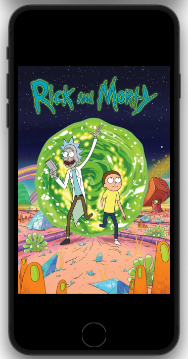
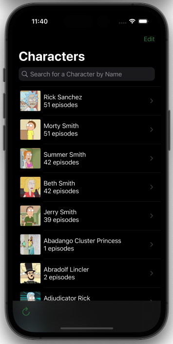
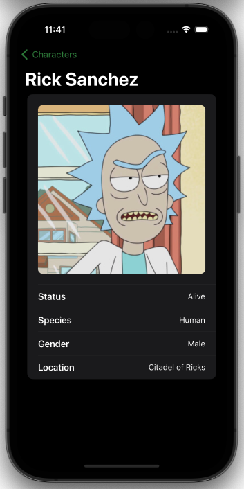
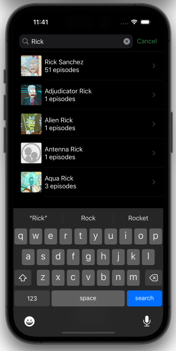

# Rick and Morty App

    
    
    
    

A mobile app using the [Rick and Morty API](https://rickandmortyapi.com/).

## Requirements

### Functional Requirements
- After launching, the app should display characters, using the `/character` endpoint.
  - For each character show a thumbnail, name and the amount of episodes the
character appeared in.
  - Display 20 characters.
- User should be able to search for a character by name.
- Tapping on a character should display a detailed view, with:
  - Photo/Image
  - Name
  - Status
  - Species
  - Gender
  - Current location
- Make use of the Rick and Morty REST API.
