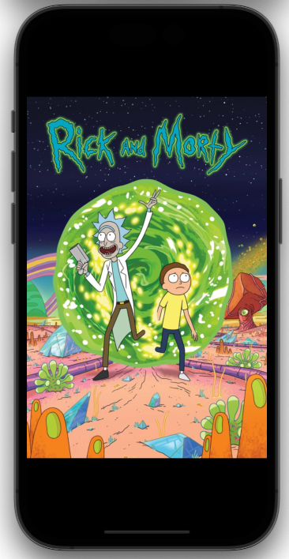

# Rick and Morty App

<!--
-->
<!--    -->
<!--    -->
<!--    -->
<!--    -->
<!--
-->

    
    
    
    

## Requirements
- After launching, the app should display characters, using the `/character` endpoint of the [Rick and Morty API](https://rickandmortyapi.com/).
- For each character show a thumbnail, name and the amount of episodes the
character appeared in.
- Display 20 characters initially and fetch more characters in batches of 20.
- User should be able to search for a character by name.
- Tapping on a character should display a detailed view, with:
  - Photo/Image
  - Name
  - Status
  - Species
  - Gender
  - Current location

<link rel="stylesheet" type="text/css" href="assets/MyStyle.css">
